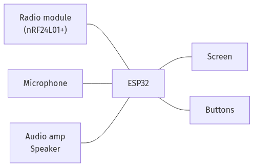

# FELCOM

FELCOM is a secure handheld communication device built around the ESP32 and nRF24L01+. The firmware supports frequency-hopping communication, text chat, voice, synchronization, and RF testing.



## Repository layout

- [`FELCOM/`](FELCOM/) - PlatformIO firmware project.
- [`hardware/`](hardware/) - KiCad PCB design, fabrication outputs, and hardware images.
- [`docs/`](docs/) - Project notes, report sources and deliverables, diagrams, and hardware documentation.
- [`miscExperimenting/`](miscExperimenting/) - Earlier Arduino sketches and communication experiments.
- [`template/`](template/) - Typst report template and license.

## Documentation

- [`docs/felcom/AUDIO.md`](docs/felcom/AUDIO.md) - Audio pipeline, wiring, FEC behavior, and troubleshooting.
- [`docs/felcom/fhss.md`](docs/felcom/fhss.md) - FHSS channels, packet format, and synchronization design.
- [`docs/hardware/README.md`](docs/hardware/README.md) - Circuit assembly references.
- [`docs/report/`](docs/report/) - Typst report source, PDF report, and presentation.
- [`docs/diagrams/`](docs/diagrams/) - Mermaid source files and rendered report diagrams.

## Build and upload

Install PlatformIO, connect an ESP32 development board, and run the commands from `FELCOM/`:

```sh
pio run -e esp32dev
pio run -e esp32dev -t upload
```

The two communicating boards must run the same firmware. Use the Sync Test screen to synchronize their hopping schedule before using chat or audio.

## Hardware

The main hardware design is in [`hardware/fabrication_pcb/`](hardware/fabrication_pcb/). Consult the hardware documentation before assembling a board. Pin assignments and firmware configuration are in [`FELCOM/include/config.h`](FELCOM/include/config.h).


## Report

The current report and presentation are available in [`docs/report/`](docs/report/). The report source is compiled with Typst and uses the diagrams in [`docs/diagrams/`](docs/diagrams/) and images in [`hardware/imgs/`](hardware/imgs/).
